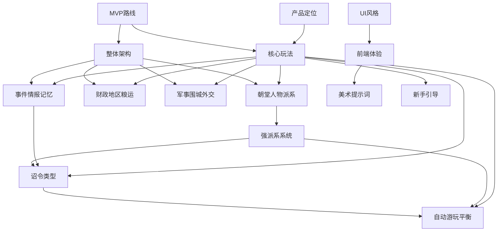

# 《朕不南渡》设计文档总索引

《朕不南渡》是一款参考当前《明末力挽狂澜》对话式政略模拟框架的新历史题材游戏。它保留“奏报、召见、密令、拟旨、执行偏差、月末结算、长期记忆”的核心骨架，但把历史舞台换成靖康之变前夜的北宋。

玩家扮演临危即位的宋钦宗赵桓，拥有一段关于汴京城破、二帝北狩、半壁山河沦陷的未来梦境。游戏目标不是照着历史走，而是在十几到几十个高压回合内重整朝堂、守住汴京、改写靖康。

## 核心定位

- **历史改命**：玩家知道最坏结局，所有行动都围绕“这次汴京不破”展开。
- **朝堂清算爽点**：查账、密探、对质、罢黜、抄没、换将、追饷，形成可截图的殿前翻案瞬间。
- **围城倒计时**：金军南下、勤王迟疑、粮价飞涨、主和派逼宫，每月都有明确压力。
- **对话式政略**：大臣不是按钮，而是有立场、有胆怯、有利益网络的人。
- **强反馈结算**：一道旨意落下，立即看到国库、城防、军心、派系、地区、战线的变化。

## 推荐阅读路径

### 快速了解项目

1. [01-product-positioning.md](./01-product-positioning.md)
2. [03-core-gameplay.md](./03-core-gameplay.md)
3. [09-mvp-roadmap.md](./09-mvp-roadmap.md)

### 准备立项或拆任务

1. [02-overall-architecture.md](./02-overall-architecture.md)
2. [09-mvp-roadmap.md](./09-mvp-roadmap.md)
3. [11-directive-types.md](./11-directive-types.md)
4. [12-autoplay-balancing.md](./12-autoplay-balancing.md)

### 设计玩法系统

1. [03-core-gameplay.md](./03-core-gameplay.md)
2. [04-court-characters-factions.md](./04-court-characters-factions.md)
3. [05-finance-regions-logistics.md](./05-finance-regions-logistics.md)
4. [06-military-siege-diplomacy.md](./06-military-siege-diplomacy.md)
5. [07-events-intel-memory.md](./07-events-intel-memory.md)

### 设计前端和美术

1. [08-ui-art-direction.md](./08-ui-art-direction.md)
2. [14-frontend-experience.md](./14-frontend-experience.md)
3. [15-art-asset-prompts.md](./15-art-asset-prompts.md)

### 打磨长期体验

1. [10-advanced-faction-system.md](./10-advanced-faction-system.md)
2. [11-directive-types.md](./11-directive-types.md)
3. [12-autoplay-balancing.md](./12-autoplay-balancing.md)
4. [13-new-player-onboarding.md](./13-new-player-onboarding.md)

## 文档分组

### A. 产品与总体设计

| 文档 | 职责 | 适合谁读 |
| --- | --- | --- |
| [01-product-positioning.md](./01-product-positioning.md) | 产品定位、玩家幻想、爽点、题材边界、“想做成什么” | 所有人 |
| [02-overall-architecture.md](./02-overall-architecture.md) | 技术与内容架构、模块映射、数据表、Agent 管线 | 工程、系统设计 |
| [03-core-gameplay.md](./03-core-gameplay.md) | 回合循环、胜负目标、资源、行动预算、爽点节奏 | 玩法、产品、工程 |
| [09-mvp-roadmap.md](./09-mvp-roadmap.md) | MVP 范围、里程碑、首批人物/事件/UI、风险 | 产品、制作、工程 |

### B. 核心玩法系统

| 文档 | 职责 | 重点 |
| --- | --- | --- |
| [04-court-characters-factions.md](./04-court-characters-factions.md) | 朝堂、人物、官职、基础派系、殿前对质 | “信谁、用谁、查谁” |
| [05-finance-regions-logistics.md](./05-finance-regions-logistics.md) | 财政、地区、粮运、粮价、抄没追赃 | “没有钱粮，圣旨只是纸” |
| [06-military-siege-diplomacy.md](./06-military-siege-diplomacy.md) | 军队、汴京围城、勤王、河东、金宋外交 | “守城不是战棋，是政略压力” |
| [07-events-intel-memory.md](./07-events-intel-memory.md) | 事件、情报、密令、证据、记忆、历史锚点 | “问题如何出现，世界如何记住” |

### C. 深度机制扩展

| 文档 | 职责 | 重点 |
| --- | --- | --- |
| [10-advanced-faction-system.md](./10-advanced-faction-system.md) | 强派系系统、利益网络、反扑时钟、执行链路、派系 UI | “官僚网如何记仇和反扑” |
| [11-directive-types.md](./11-directive-types.md) | 丰富诏令类型、文书形式、行动模板、拟旨校验、回奏 | “圣旨如何从话变成执行链” |
| [12-autoplay-balancing.md](./12-autoplay-balancing.md) | 自动游玩、路线覆盖、数值护栏、早崩检测、平衡报告 | “怎么防止路线飞天或过早崩盘” |
| [13-new-player-onboarding.md](./13-new-player-onboarding.md) | 新手引导、首局脚本、渐进揭示、失败复盘 | “第一次当皇帝怎么不懵” |

### D. 前端、美术与体验

| 文档 | 职责 | 重点 |
| --- | --- | --- |
| [08-ui-art-direction.md](./08-ui-art-direction.md) | UI 风格、视觉基调、布局、组件、响应式和资产需求 | “长什么样” |
| [14-frontend-experience.md](./14-frontend-experience.md) | 地图交互、奏疏阅读、人物关系、月末报告、跨界面联动 | “玩起来顺不顺” |
| [15-art-asset-prompts.md](./15-art-asset-prompts.md) | 地图、人物、事件、UI 纹理、图标、结局图的生图提示词 | “素材怎么生成” |

## 系统关系图

## 和当前项目的关系

当前项目里已经验证过的结构可以直接复用为设计参考：

- `GameSession`：维持当前局状态、召见、拟旨、颁诏、结算。
- `content/*`：人物、地区、军队、事件、提示词全部数据驱动。
- `issues`：把危机和改革变成可追踪进度条。
- `secret_orders`：密令查证、暗中执行、到期回奏。
- `event_memories`：让人物、地区、派系记住玩家做过什么。
- `decree_writer / simulator / extractor`：自然语言旨意到结构化效果的推演链。
- `web`：地图、朝臣、奏疏、邸报、拟旨、存档的网页式界面。

《朕不南渡》不是简单换皮。它的独特系统应当是：

- **汴京围城盘面**：城墙、城门、粮储、水源、火患、民心、主和压力。
- **勤王响应链**：各路军是否起兵、走到哪里、被谁拖住、能否入援。
- **金军谈判压力**：索金、割地、质子、退兵、再犯的动态关系。
- **殿前对质模式**：把密令查到的证据转化为公开清算爽点。
- **亡国倒计时**：以历史锚点和动态阈值共同推动危机。

## 统一命名规范

- 文档编号使用两位数字：`00-` 到 `15-`。
- 产品级文档放前面，系统级文档居中，体验与资产文档靠后。
- 新增文档优先追加编号，不重排旧编号，避免链接失效。
- 文档标题使用一个一级标题，后续使用二级/三级标题。
- 同一概念尽量使用统一名称：
  - `汴京`，不用混写“开封”作为主称。
  - `诏令` 指玩家行动系统，`圣旨/手诏/密札/军令/榜文` 是文书形式。
  - `月末报告` 指结算呈现，`回奏` 指具体执行结果文本。
  - `派系` 指利益网络，不等同于简单阵营。

## 维护原则

1. 产品愿景改动优先更新 [01-product-positioning.md](./01-product-positioning.md)。
2. 玩法循环改动优先更新 [03-core-gameplay.md](./03-core-gameplay.md)。
3. 技术/数据/Agent 管线改动优先更新 [02-overall-architecture.md](./02-overall-architecture.md)。
4. UI 视觉改动写入 [08-ui-art-direction.md](./08-ui-art-direction.md)，交互流程改动写入 [14-frontend-experience.md](./14-frontend-experience.md)。
5. 新系统若只是扩展现有系统，先补到对应系统文档；足够复杂时再新增编号文档。
6. 每次新增文档都要更新本索引。
